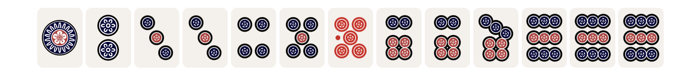

# Obsidian Mahjong Renderer

Obsidian Community Plugin to Render Mahjong hands using mahjong notation.

## Screenshots
Light Theme


Dark Theme


## Features
- Dark mode

## Future Plans
- Different tile themes
- Computing han and fu
- Tile variants for Chineese / Singaporean variants (flowers, animals)

# Installation
To be completed

# Usage

Create a code block (three ticks) with mahjong as a language.
Provide mahjong notation like `123m456p789s11z`.
Once you click away from the block or switch to reader mode, you should see tiles.


## Syntax
Tile Groups


| Tile Group | Meaning                                       |
|------------|-----------------------------------------------|
| m          | Man (Characters) suits: 1m, 2m, ..., 9m       |
| p          | Pin (Dots) suits: 1p, 2p, ..., 9p             |
| s          | Sou (Bamboo) suits: 1s, 2s, ..., 9s           |
| z          | Honor tiles: 1z (East), 2z (South), 3z (West), 4z (North), 5z (White), 6z (Green), 7z (Red) |
| 0          | Red Five (can be used in place of 5m, 5p, or 5s) |

Tiles are represented by their number followed by their suit (e.g., 1m, 3p, 7s, 5z).
Groups of tiles are written without spaces (e.g., 123m for 1-man, 2-man, 3-man).

Example:
```mahjong
123m 456p 789s 11z
```
This represents a hand with 1-2-3 of man, 4-5-6 of pin, 7-8-9 of sou, and a pair of East wind tiles.

Special Notations
Rotations

A single quote (') after a tile indicates that it's rotated 90 degrees (usually to represent a called tile from another player).

Example:
```mahjong
23m 45'6p 789s 11z
```

This shows that the 5-pin tile has been called and is rotated.
Kans (Quads)

A double quote (") after a tile indicates a closed kan (quad).
An additional tile with a single quote represents an open kan.

Examples:
```mahjong
123m 5555"p 789s 11z
```

This shows a closed kan of 5-pin.
```mahjong
123m 555'5p 789s 11z
```

This shows an open kan of 5-pin.
Multiline Rendering
For complex hands or to show discarded tiles, you can use multiple lines. Each line is separated by a space.

Example:

```mahjong
123m 456p 789s 11z
22'2s 44'4p
```

This represents a hand with 1-2-3 of man, 4-5-6 of pin, 7-8-9 of sou, a pair of East wind tiles, and two called melds: a triplet of 2-sou and a triplet of 4-pin.
Red Five
The 0 (zero) can be used to represent a red five in any suit. The suit is determined by its position among other tiles of the same suit.

Example:

```mahjong
123m 40p 789s 11z
```
This shows a red 5-pin among the pin tiles.


# Example hands

## Four Kans

```mahjong
4z 66"6p222'2m0770z4444's
```


## Flush
```mahjong
1233450667999p
```

